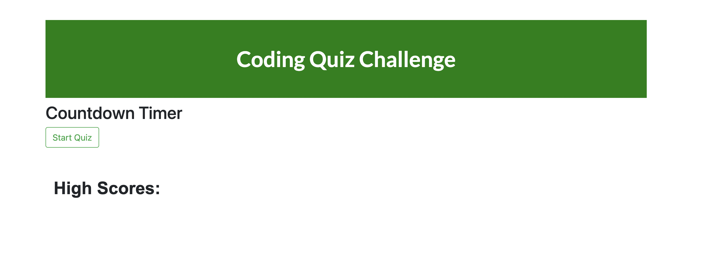

# Homework 4 Coding Quiz Challenge

## Description

This code quiz was built using HTML, CSS, Javascript, and Bootstrap.

When the user clicks the start button, the timer begins to countdown from 30 as the first question appears. When the user clicks on an answer, a window pops up alerting the user to whether or not their answer was correct. If the answer is correct, a new question appears. If the user gets the question incorrect, 5 seconds are subtracted from the timer and the same question remains until the user chooses the correct answer.

Upon answering the five questions correctly, the user receives a score. They can then enter their initials and their score is saved to the screen. If the timer reaches zero before all the questions are answered, the user is alerted that they have lost the game.

## Screenshot

## Links to Application

- Here is a link to the repository: https://github.com/heatherveva/hw4.git
- Here is the page: https://heatherveva.github.io/hw4/
